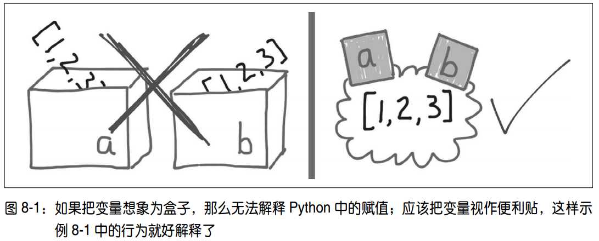

# 3.1 对象引用与垃圾回收
变量保存的是引用:
  - 简单的赋值不创建副本
  - 对 += 或 \*= 所做的增量赋值来说，如果左边的变量绑定的是不可变对象，会创建新对象；如果是可变对象，会就地修改
  - 为现有的变量赋予新值，不会修改之前绑定的变量 -- 重新绑定
  - 函数的参数以别名的形式传递,函数可能会修改通过参数传入的可变对象
  - 使用可变类型作为函数参数的默认值有危险，因为如果就地修改了参数，默认值也就变了，这会影响以后使用默认值的调用

## 1. 变量与对象
### 1.1 引用式变量
  - 理解: 引用式变量不是存储数据的盒子，而是附加在对象上的标注
  - a=[]:
    - Python 中赋值语句的右边先执行，对象在右边创建或获取，在此之后左边的变量才会绑定到对象上，就像为对象贴上标注
    - 说把变量分配给对象更合理，反过来说有问题，因为对象在赋值之前就创建了



### 1.2 标识、 相等性和别名
标识:
   - 每个变量都有标识、类型和值。对象一旦创建，它的标识绝不会变；
   - 你可以把标识理解为对象在内存中的地址。
   - is 运算符比较两个对象的标识； id() 函数返回对象标识的整数表示

别名: 即两个变量绑定同一个对象

is 与 ==:
  - == 运算符比较两个对象的值（对象中保存的数据），而 is 比较对象的标识
  - 在变量和单例值之间比较时，应该使用 is,  eg:  x is None
  - is 运算符比 == 速度快，因为它不能重载，Python 不用寻找并调用特殊方法，而是直接比较对象 ID
  - a == b 是语法糖，等同于 a.\_\_eq\_\_(b)。继承自 object 的 \_\_eq\_\_
  方法比较两个对象的 ID，结果与 is 一样，多数内置类型会覆盖\_\_eq\_\_ 方法

### 1.3 元组的相对不可变性
相对不可变性:
  - 元组(和frozenset)与多数 Python 集合（列表、字典、集，等等）一样，保存的是对象的引用
  - 元组的不可变性其实是指 tuple 数据结构的物理内容（即保存的引用）不可变，与引用的对象无关，
  即元组本身不可变，元素依然可变
  - 而 str、 bytes 和 array.array 等单一类型序列是扁平的，它们保存的不是引用，而是
  在连续的内存中保存数据本身

## 2. 浅层与深层复制
浅复制:
  - 即复制了最外层容器，副本中的元素是源容器中元素的引用
  - 构造方法(list(a))或 a[: ] 都是浅复制

copy 模块:
  - 文档:  http://docs.python.org/3/library/copy.html
  - copy.copy(): 浅层复制  
  - copy.deepcopy():
    - 深层复制
    - deepcopy 函数会记住已经复制的对象，因此能优雅地处理循环引用
  - 可以实现特殊方法 \_\_copy\_\_() 和 \_\_deepcopy\_\_()，控制 copy 和 deepcopy 的行为

## 3. Python 传参方式
### 3.1 共享传参
  - 定义: 指函数的各个形式参数获得实参中各个 **引用的副本**。也就是说，函数内部的形参是实参的别名
  - 影响: 函数可能会修改作为参数传入的可变对象，但是无法修改那些对象的标识
  （即不能把一个对象替换成另一个对象）
  - 附注: 这是 Python 唯一支持的参数传递模式

### 3.2 可变值作为默认值
```python
class HauntedBus:
    """A bus model haunted by ghost passengers"""

    def __init__(self, passengers=[]):   ➊
        self.passengers = passengers  ➋

    def pick(self, name):
        self.passengers.append(name)  ➌

    def drop(self, name):
        self.passengers.remove(name)

>>> bus2 = HauntedBus()
>>> bus2.pick('Carrie')
>>> bus3 = HauntedBus()
>>> bus3.passengers
['Carrie']
>>> bus3.pick('Dave')
>>> dir(HauntedBus.__init__) # doctest:  +ELLIPSIS
['__annotations__', '__call__', ..., '__defaults__', ...]
>>> HauntedBus.__init__.__defaults__ # 默认值变成了函数对象的属性
(['Carrie', 'Dave'],)

>>> HauntedBus.__init__.__defaults__[0] is bus2.passengers
True
```
分析:
  - ➊ 如果没传入 passengers 参数，使用默认绑定的列表对象，一开始是空列表。
  - ➋ 这个赋值语句把 self.passengers 变成 passengers 的别名，而没有传入 passengers 参
数时，后者又是默认列表的别名。
  - ➌ 在 self.passengers 上调用 .remove() 和 .append() 方法时，修改的其实是默认列表，
它是函数对象的一个属性
  - 问题在于，没有指定初始乘客的 HauntedBus 实例会共享同一个乘客列表

默认值:
  - 默认值在定义函数时计算（通常在加载模块时），因此默认值变成了函数对象的属性
  - 如果默认值是可变对象，而且修改了它的值，那么后续的函数调用都会受到影响
  - 通常使用 None 作为接收可变值的参数的默认值

防御可变参数:
  - 除非确实想修改通过参数传入的对象，否则一定要创建参数的副本

```python
class TwilightBus:
    """A bus model that makes passengers vanish"""

    def __init__(self, passengers=None):
        if passengers is None:
            self.passengers = []
        else:
            self.passengers = list(passengers)  # 创建并引用参数的副本，而不是别名
```

## 4. del 和垃圾回收
del:
  - del 语句删除名称，而不是对象
  - 仅当删除的变量保存的是对象的最后一个引用，或者无法得到对象时,对象才会被删除
  - 重新绑定也可能会导致对象的引用数量归零，导致对象被销毁

\_\_del\_\_:
  - 将销毁实例时， Python 解释器会调用 \_\_del\_\_ 方法，给实例最后的机会，释放外部资源
  - 不会销毁实例，不应该在代码中调用
  - 文档:  https://docs.python.org/3/reference/datamodel.html#object.__del__
  - Jesse Jiryu Davis 写的“ PyPy, Garbage Collection, and a Deadlock”
  对 \_\_del\_\_ 方法的恰当用法和不当用法做了讨论 https://emptysqua.re/blog/pypy-garbage-collection-and-a-deadlock/

CPython对象删除:
  - 垃圾回收使用的主要算法是引用计数。每个对象都会统计有多少引用指向自己。当引用计数归零时，立即就被销毁
  - CPython 会在对象上调用 \_\_del\_\_ 方法（如果定义了），然后释放分配给对象的内存
  - CPython 2.0 增加了分代垃圾回收算法，用于检测引用循环中涉及的对象组
  - CPython 3.4 改进了处理有 \_\_del\_\_ 方法的对象的方式， 参见 PEP 442—Safe object
finalization（https://www.python.org/dev/peps/pep-0442/）


## 4. 弱引用
### 4.1 基础概念
弱引用:
  - 定义: 弱引用不会增加对象的引用数量
  - 应用: 弱引用在缓存应用中很有用
  - 概念: 引用的目标对象称为**所指对象**
  - 局限: 不是每个 Python 对象都可以作为弱引用的目标（或称所指对象）
    - 基本的 list 和 dict 实例不能作为所指对象，但是它们的子类可以
    - set 实例可以作为所指对象，用户定义的类型也没问题
    - int 和 tuple 实例不能作为弱引用的目标，甚至它们的子类也不行
    - 原因: 与CPython 实现细节有关


### 4.2 weak 模块:
**weak简介**:
  - 文档:  http://docs.python.org/3/library/weakref.html
  - 底层接口: 供高级接口使用，不要手动创建并处理 weakref.ref 实例
    - wref = weak.ref(obj):  获取所指对象  
    - wref(): 返回被引用对象，如果所指对象不存在了，返回 None
  - 高层接口: WeakKeyDictionary、 WeakValueDictionary、 WeakSet 和 finalize

```python
>>> import weakref
>>> a_set = {0, 1}
>>> wref = weakref.ref(a_set) ➊
>>> wref() ➋
{0, 1}

>>> import weakref
>>> s2 = {1, 2, 3}
>>> def bye():  ➋
  print('Gone with the wind...')

>>> ender = weakref.finalize(s1, bye) #  在 s1 引用的对象上注册 bye 回调
>>> ender.alive ➍
True
>>> s2 = 'spam'  # 对象被销毁了，调用了 bye 回调
Gone with the wind...
>>> ender.alive
False
```

**WeakValueDictory**:
  - 作用:
    - 一种可变映射，里面的值是对象的弱引用
    - 被引用的对象被当作垃圾回收后，对应的键会自动从 WeakValueDictionary 中删除
    - 经常用于缓存

```python
>>> import weakref
>>> stock = weakref.WeakValueDictionary()
>>> catalog = [Cheese('Red Leicester'), Cheese('Tilsit'),
...                 Cheese('Brie'), Cheese('Parmesan')]
...
>>> for cheese in catalog:  # stock 把奶酪的名称映射到 catalog 中 Cheese 实例的弱引用上
...     stock[cheese.kind] = cheese
...
>>> sorted(stock.keys())
['Brie', 'Parmesan', 'Red Leicester', 'Tilsit']
>>> del catalog
>>> sorted(stock.keys())
['Parmesan']
>>> del cheese
>>> sorted(stock.keys())
[]
```

**WeakKeyDictionary**:
  - 键是弱引用
  - 用途: 可以为应用中其他部分拥有的对象附加数据，这样就无需为对象添加属性。
  这对覆盖属性访问权限的对象尤其有用？？
  - 文档:  https://docs.python.org/3/library/weakref.html?highlight=weakref#weakref.WeakKeyDictionary

**WeakSet**
  - 作用: 保存元素弱引用的集合类。元素没有强引用时，集合会把它删除
  - 应用: 如果一个类需要知道所有实例，一种好的方案是创建一个 WeakSet 类型的类属性，保存实例的引用
  - 附注: 如果使用常规的 set，实例永远不会被垃圾回收，因为类中有实例的强引用，
  而类存在的时间与 Python 进程一样长，除非显式删除类

## 5. Python对不可变类型施加的把戏
1. tuple:
  - t[: ] 不创建副本，而是返回同一个对象的引用
  - tuple(t) 获得的也是同一个元组的引用
2. str、 bytes 和 frozenset: 与元组类似
  - frozenset 实例不是序列，因此不能使用 fs[: ]
  - 但是， fs.copy() 具有相同的效果，返回同一个对象的引用
3. 字符串字面量可能会创建共享的对象
  - 共享字符串字面量是一种优化措施，称为驻留（ interning）
  - CPython 还会在小的整数上使用这个优化措施，防止重复创建“热门”数字，如 0、 -1 和 42
  - 注意， CPython 不会驻留所有字符串和整数，驻留的条件是实现细节，而且没有文档说明

```python
>>> t1 = (1, 2, 3)
>>> t3 = (1, 2, 3) # ➊
>>> t3 is t1 # ➋
False
>>> s1 = 'ABC'
>>> s2 = 'ABC' # ➌
>>> s2 is s1 # ➍
True
```


## 延伸阅读
### Python:
Python 语言参考手册:
  - Data Model 一章的开头清楚解释了对象的标识和值
  - https://docs.python.org/3/reference/datamodel.html

gc 模块
  - 作用: 为可选的垃圾回收程序提供接口
  - 文档: https://docs.python.org/3/library/gc.html

### blog:
Wesley Chun 在 OSCON 2013 的演讲:
  - PPT:  http://conferences.oreilly.com/oscon/oscon2013/public/schedule/detail/29374
  - 视频: https://www.youtube.com/watch?v=HHFCFJSPWrI

Doug Hellmann:
  -  Python Module of the Week -- 后来集结成书，即《 Python 标准库》
  -  https://pymotw.com/3/

Fredrik Lundh:
  - How Does Python Manage Memory?
  -  http://effbot.org/pyfaq/how-does-python-manage-memory.htm

字符串驻留: https://en.wikipedia.org/wiki/String_interning

### 实用工具  
Python Tutor 网站: http://www.pythontutor.com

### 书籍:
《 Python 标准库》
  - copy – Duplicate Objects http://pymotw.com/2/copy/
  - weakref – Garbage-Collectable References to Objects http://pymotw.com/2/weakref/

《程序设计语言——实践之路（第 3版）》

## 杂谈
\_\_eq\_\_ 方法:
  - 作用: 决定 == 如何比较实例
  - 从 object 继承的方法比较对象的 ID

用户定义的类:
  - 实例默认可变
  - 如果需要不可变的对象，此时对象的每个属性都必须是不可变的
  - 可变对象还是导致多线程编程难以处理的主要原因，因为某个线程改动对象后，如果
不正确地同步，那就会损坏数据。但是过度同步又会导致死锁

对象析构和垃圾回收:
  - Python 没有直接销毁对象的机制
  - CPython 中的垃圾回收主要依靠引用计数
  - 这意味着，在 CPython 中，这样写是安全的（至少目前如此）:
`open('test.txt', 'wt', encoding='utf-8').write('1, 2, 3')`
这行代码是安全的，因为文件对象的引用数量会在 write 方法返回后归零， Python
在销毁内存中表示文件的对象之前，会立即关闭文件，这行代码在 Jython 或IronPython 中却不安全，
因为它们使用的是宿主运行时（ Java VM 和 .NET CLR）中的垃圾回收程序，
那些回收程序更复杂，但是不依靠引用计数，而且销毁对象和关闭文件的时间可能更长
  - 在任何情况下，包括 CPython，最好显式关闭文件；而关闭文件的最可靠方式是使用 with 语句

参数传递模式
  - 有按值传递: 函数得到参数的副本
  - 按引用传递: 函数得到参数的指针
  - 共享传参:
    - 函数得到参数的副本，但是参数始终是引用
    - 因为函数得到的是参数引用的副本，所以重新绑定对函数外部没有影响
