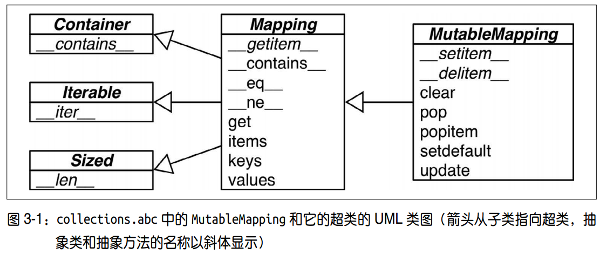

# 1.3 字典和集合
## 1. 内置散列类型概览


抽象基类：
  - 作用：
    - 主要作用是作为形式化的文档，定义了构建一个映射类型所需要的最基本的接口
    - 跟 isinstance 一起被用来判定某个数据是不是广义上的映射类型

```python
>>> my_dict = {}
>>> isinstance(my_dict, abc.Mapping)
True
```

非抽象映射类型：
  - 一般不会直接继承这些抽象基类，而是直接对 dict 或是 collections.User.Dict 进行扩展
  - 标准库里的所有映射类型都是利用 dict 来实现的，因此它们有个共同的限制，
  只有可散列的数据类型才能用作这些映射里的键

可散列的数据类型：
  - 定义：
    - 在这个对象的生命周期中，它的散列值不可变
    - 需要实现 \_\_hash\_\_() 方法
    - 需要 \_\_eq\_\_()方法， 才能跟其他键做比较
    - 两个可散列对象是相等的，那么它们的散列值一定是一样的
  - 分类：
    - 原子不可变数据类型（ str、 bytes 和数值类型）都是可散列类型
    - frozenset 也是可散列的，因为根据其定义， frozenset 只能容纳可散列类型
    - 元组只有当所包含的所有元素都是可散列类型的情况下，才是可散列的
  - 自定义类：
    - 用户自定义的类型的对象都是可散列的，散列值是它们的 id() 函数返回值
    - 所以所有这些对象在比较的时候都是不相等的
    - 如果一个对象实现了 \_\_eq\_\_ 方法，并且在方法中用到了这个对象的内部状态，
    那么只有当所有这些内部状态都是不可变的情况下，这个对象才是可散列的


## 2. 字典用法
### 2.1 常见的映射方法
表3-1： dict、 **collections.defaultdict** 和 **collections.OrderedDict**

|方法|dict|default|Ordered|作用|
|:---|:---|:---|:---|:---|:---|
|d.clear() |• |• |• |移除所有元素|
|d.\_\_contains\_\_(k) |• |• |• |检查 k 是否在 d 中|
|d.copy() |• |• |• |浅复制|
|d.\_\_copy\_\_() |• |||用于支持 copy.copy|
|d.default_factory ||• ||在 \_\_missing\_\_ 函数中被调用的函数，用以给未找到的元素设置值 *|
|d.\_\_delitem\_\_(k) |• |• |• |del d[k]，移除键为 k 的元素|
|d.fromkeys(it, [initial]) |• |• |• |将迭代器 it 里的元素设置为映射里的键，如果有 initial 参数，就把它作为这些键对应的值（默认是 None）|
|d.get(k, [default]) |• |• |• |返回键 k 对应的值，如果字典里没有键k，则返回 None 或者 default|
|d.\_\_getitem\_\_(k) |• |• |• |让字典 d 能用 d[k] 的形式返回键 k 对应的值|
|d.items() |• |• |• |返回 d 里所有的键值对|
|d.\_\_iter\_\_() |• |• |• |获取键的迭代器|
|d.keys() |• |• |• |获取所有的键|
|d.\_\_len\_\_() |• |• |• |可以用 len(d) 的形式得到字典里键值对的数量|
|**d.\_\_missing\_\_(k)**| |•| |当 \_\_getitem\_\_ 找不到对应键的时候，这个方法会被调用|
|d.move_to_end(k, [last])|| |•| 把键为 k 的元素移动到最靠前或者最靠后的位置（ last 的默认值是 True）|
|d.pop(k, [defaul] |• |• |• |返回键 k 所对应的值，然后移除这个键值对。如果没有这个键，返回 None 或者default|
|d.popitem() |• |• |• |随机返回一个键值对并从字典里移除它 #|
|d.\_\_reversed\_\_() |||• |返回倒序的键的迭代器|
|d.setdefault(k, [default]) |• |• |• |若字典里有键 k，则把它对应的值设置为default，然后返回这个值；若无，则让d[k] = default，然后返回 default|
|d.\_\_setitem\_\_(k, v) |• |• |•| 实现 d[k] = v 操作，把 k 对应的值设为 v|
|d.update(m, [**kargs]) |• |• |•| m 可以是映射或者键值对迭代器，用来更新 d 里对应的条目|
|d.values() |•| •| •| 返回字典里的所有值|


附注：
  - default_factory 并不是一个方法，而是一个可调用对象（ callable），
  它的值在 defaultdict 初始化的时候由用户设定
  - OrderedDict.popitem() 会移除字典里最先插入的元素（先进先出）；
  同时这个方法还有一个可选的 last参数，若为真，则会移除最后插入的元素（后进先出）
